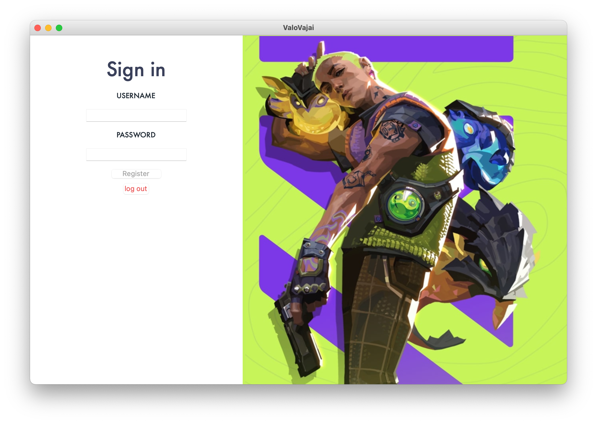
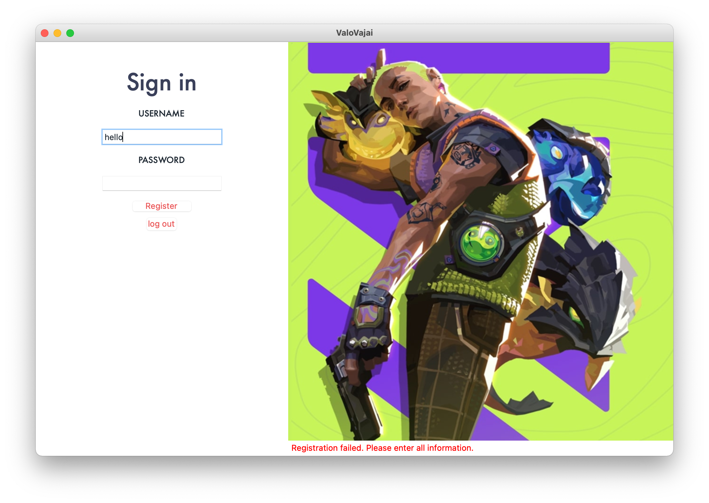
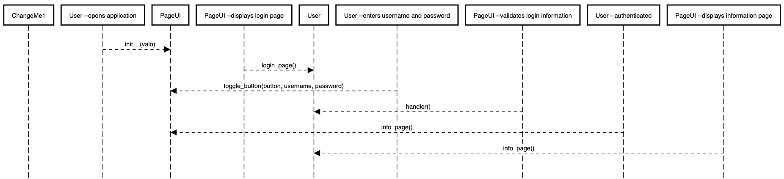
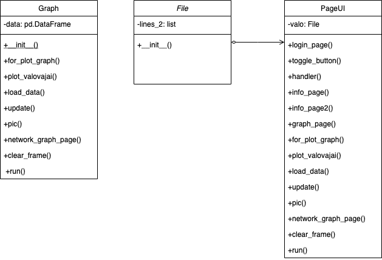
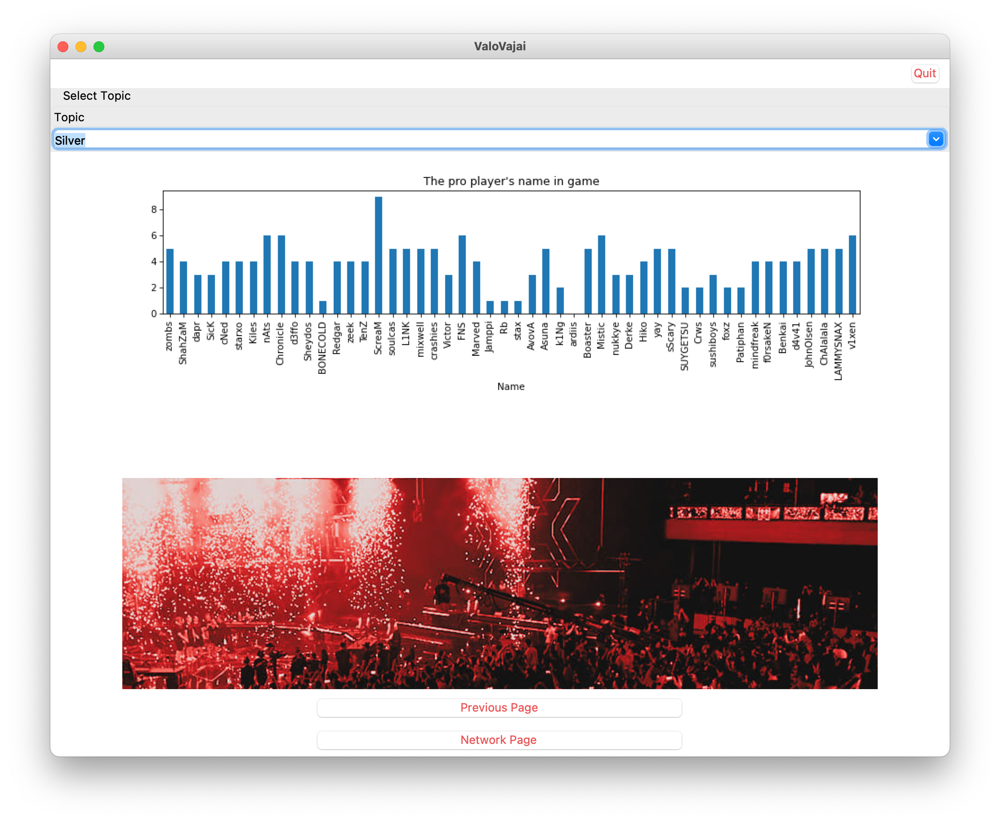
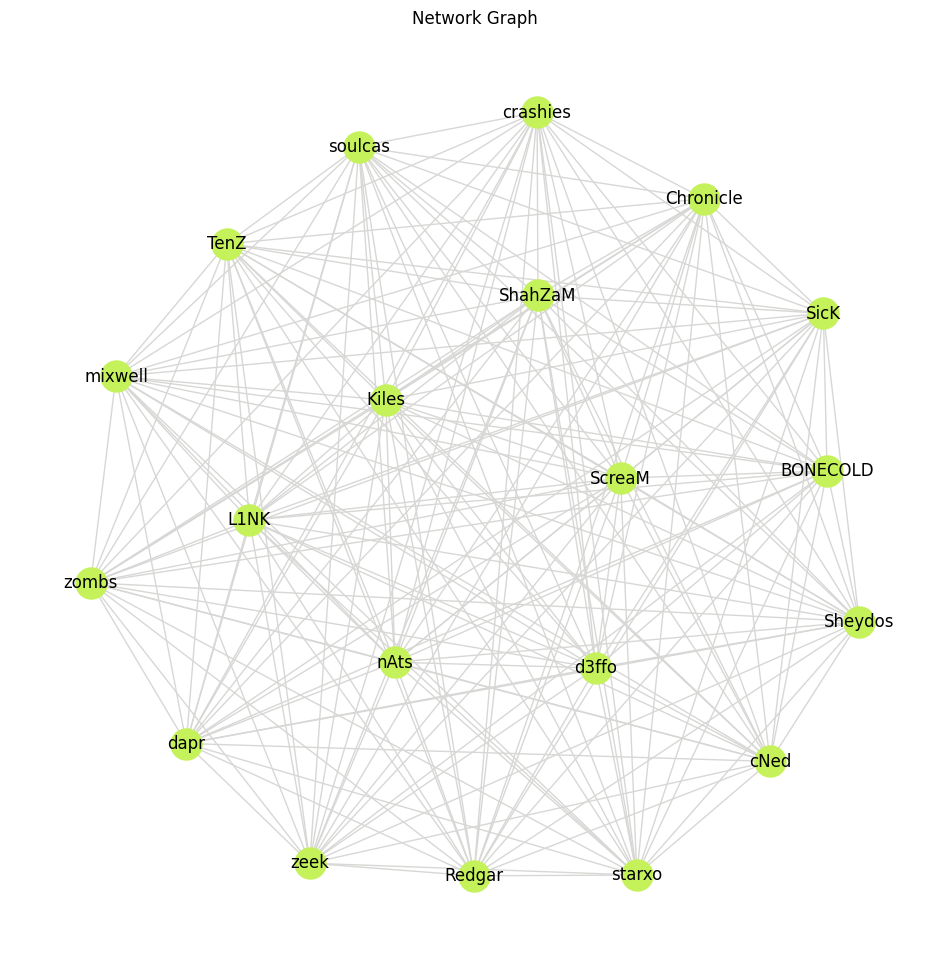

# Valo Vajai
 
## Description
ValoVajai is a user interface that displays data and graphs related to the professional Valorant teams and players in the VCT competition. 
It provides valuable insights into team and player performance, match schedules and results, and key metrics to help users better understand the VCT tournament. 
The data is sourced from the official VCT website at [VCT](https://valorantesports.com.)
> 
This is the login page where the user needs to enter their username and password to log in. If the user has not registered yet, the Register button will not be `clickable`. 

> 
If the user tries to register with incomplete information, an error message will appear saying "**Registration failed. Please enter all information**" to prompt the user to enter all required information.

## Data Sources
The data was obtained from the following Kaggle dataset: 
[Kaggle](https://www.kaggle.com/datasets/evangower/valorant-esports-top-earnings)
 
## Running the Application
To run the application, the user can install networkx by entering the following command in the terminal or command prompt:
- [networkx](https://pypi.org/project/networkx/)
- [matplotlib](https://matplotlib.org/stable/users/installing/index.html)
- [pillow](https://pillow.readthedocs.io/en/stable/installation.html)
```commandline
pip install networkx
``` 
```commandline
pip install Pillow
```
or
```commandline
pip install networkx matplotlib Pillow
```
## Design
- This program has a visual interface that users can interact with to view information about the game Valorant and create graphs. It uses a library called tkinter for the visual elements and libraries called matplotlib and networkx to create the graphs.
 

## Design Patterns Used
- ValoVajai uses the Model-View-Controller (MVC) pattern to separate the data and business logic from the user interface. The Observer pattern is used to update the view when there are changes to the data. These patterns make the code more organized, maintainable, and scalable. 
## Graph Algorithm Used
- In ValoVajai, the network graph of game characters and their abilities is modeled as a graph problem. The problem being solved is finding the shortest path between two characters based on their abilities. This is done using Dijkstra's algorithm, which is a common algorithm used for finding the shortest path in a weighted graph. By representing the game characters and abilities as nodes and edges in a graph, the program can efficiently find the shortest path between any two characters.


 
## Other Information
- This project is based on my previous project from last year, which I have modified to include additional features and improvements. For more information about the VCT tournament, visit the [official website](https://valorantesports.com/news/the-road-to-champions-2023/en-us).
- [encoding='latin-1](https://stackoverflow.com/questions/4299802/python-convert-string-from-utf-8-to-latin-1) answered Nov 28, 2010 at 23:38 Ignacio by `Vazquez-Abrams`
- For hard stuck part will be using [ChatGPT](https://openai.com/blog/chatgpt)

### Credits
This project was created by [Danita Frikaow](https://github.com/dzptahh) as part of a `Computer Programming2`.